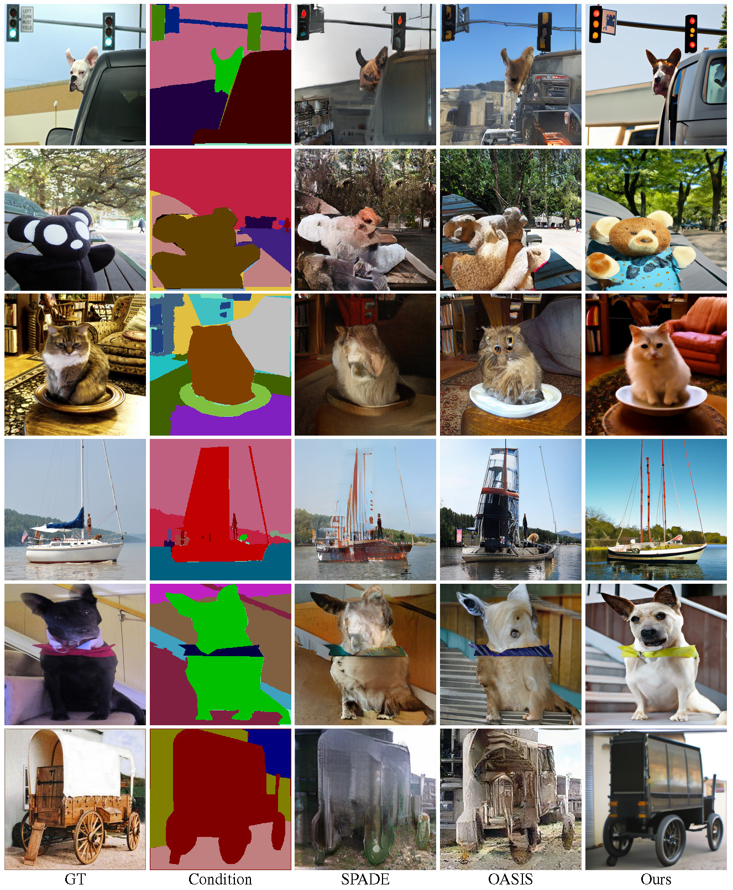

# PITI: Pretraining is All You Need for Image-to-Image Translation 
Official PyTorch implementation  
> Pretraining is All You Need for Image-to-Image Translation    
> 2022
    

[paper](https://arxiv.org/abs/2205.12952) | [project website](https://tengfei-wang.github.io/PITI/index.html) | [video]()

## Introduction
We present a simple and universal framework that brings the power of the pretraining to various
image-to-image translation tasks.  

Diverse samples synthesized by our approach.   
   

Comparison with other methods.   


## Citation
If you find this work useful for your research, please cite:

``` 
@inproceedings{wang2022pretraining,
 title = {Pretraining is All You Need for Image-to-Image Translation},
  author = {Wang, Tengfei and Zhang, Ting and Zhang, Bo and Ouyang, Hao and Chen, Dong and Chen, Qifeng and Wen, Fang},
  booktitle = {arXiv},
  year = {2022},
}
```
