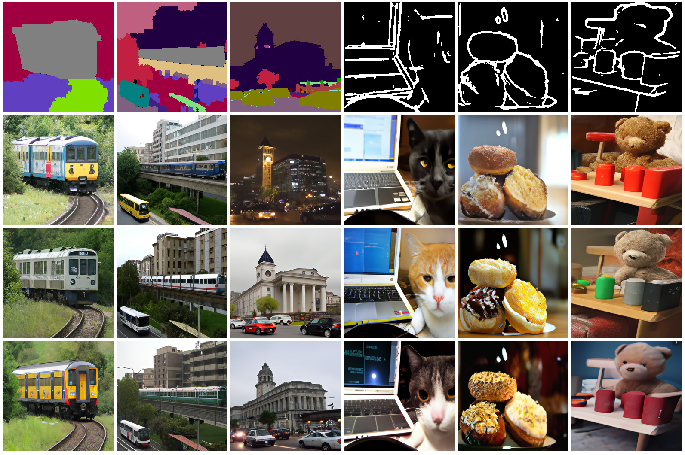

# PITI: Pretraining is All You Need for Image-to-Image Translation 
Official PyTorch implementation  
> Pretraining is All You Need for Image-to-Image Translation    
> [Tengfei Wang](https://tengfei-wang.github.io/), [Ting Zhang](https://www.microsoft.com/en-us/research/people/tinzhan/), [Bo Zhang](https://bo-zhang.me/), [Hao Ouyang](https://ken-ouyang.github.io/), [Dong Chen](http://www.dongchen.pro/), [Qifeng Chen](https://cqf.io/), [Fang Wen](https://www.microsoft.com/en-us/research/people/fangwen/)    
> 2022
    

[paper](https://arxiv.org/abs/2205.12952) | [project website](https://tengfei-wang.github.io/PITI/index.html) | [video]() | [online demo](https://huggingface.co/spaces/tfwang/PITI-Synthesis)

## Introduction
We present a simple and universal framework that brings the power of the pretraining to various
image-to-image translation tasks.  You may try our [online demo](https://huggingface.co/spaces/tfwang/PITI-Synthesis) if interested. 

Diverse samples synthesized by our approach.   
   


## Set up
### Installation
```
git clone https://github.com/PITI-Synthesis/PITI.git
cd PITI
```

### Environment
```
conda env create -f environment.yml
```

## Quick Start
### Pretrained Models
Please download our pre-trained models for both ```Base``` model and ```Upsample``` model, and put them in ```./ckpt```.
| Model | Task  | Dataset
| :--- | :----------  | :----------
|[Base-64x64](https://hkustconnect-my.sharepoint.com/:u:/g/personal/tfwang_connect_ust_hk/EVslpwvzHJxFviyd3bw6KSEBWQ9B9Oqd5xUlemo4BNcHpQ?e=F5450q)  | Mask-to-Image | Trained on COCO.
|[Upsample-64-256](https://hkustconnect-my.sharepoint.com/:u:/g/personal/tfwang_connect_ust_hk/ERPFM88nCR5Gna_i81cB_X4BgMyvkVE3uMX7R_w-LcSAEQ?e=EmL4fs) | Mask-to-Image | Trained on COCO.
|[Base-64x64](https://hkustconnect-my.sharepoint.com/:u:/g/personal/tfwang_connect_ust_hk/EQsQdJGrxaJDsDYFycIRTO4BNHdEOqZmO_QHSZVV23n5-g?e=I7FSlU) | Sketch-to-Image | Trained on COCO.
|[Upsample-64-256](https://hkustconnect-my.sharepoint.com/:u:/g/personal/tfwang_connect_ust_hk/Ec5DDBQkILpMm5lO0UeytzIBCteefJ_izY9izg7IEHAM8Q?e=6IL7Og)| Sketch-to-Image  | Trained on COCO.

If you fail to access to these links, you may alternatively find our pretrained models [here](https://hkustconnect-my.sharepoint.com/:f:/g/personal/tfwang_connect_ust_hk/Ej0KKEFuje5NnYwaR3wob7YBsca1mBoozuCwCrzc16ra_g?e=COucC2). 

### Prepare Images
We put some example images in `./test_imgs`, and you can quickly try them.  
#### COCO
For COCO dataset, download the images and annotations from the [COCO webpage](https://cocodataset.org/#home).

For mask-to-image synthesis, we use the semantic maps in RGB format as inputs. To obtain such semantic maps, run ```./preprocess/preprocess_mask.py``` (an example of the raw mask and the processed mask is given in ```preprocess/example```).  Note that we do not need instant masks like previous works. 

For sketch-to-image synthesis, we use sketch maps extracted by HED as inputs. To obtain such sketch maps, run ```./preprocess/preprocess_sketch.py```.


### Inference
#### Interactive Inference
Run the following script, and it would create an interactive GUI built by gradio. You can upload input masks or sketches and generate images.   
```
pip install gradio
python inference.py
```

#### Batch Inference
Modify `sample.sh` according to the follwing instructions, and run:   
```
bash sample.sh
```
| Args | Description
| :--- | :----------
| --model_path | the path of ckpt for base model.
| --sr_model_path | the path of ckpt for upsample model.
| --val_data_dir | the path of a txt file that contains the paths for images.
| --num_samples | number of images that you want to sample.
| --sample_c | Strength of classifier-free guidance.
| --mode | The input type.

## Training
### Preparation
1. Download and preprocess datasets. For COCO dataset, download the images and annotations from the [COCO webpage](https://cocodataset.org/#home). Run ```./preprocess/preprocess_mask.py``` or ```./preprocess/preprocess_sketch.py```    
2. Download pretrained models by ```python preprocess/download.py ```.

### Start Training
Taking mask-to-image synthesis as an example: (sketch-to-image is the same)
#### Finetune the Base Model
Modify  `mask_finetune_base.sh`  and run:
```
bash mask_finetune_base.sh
```
#### Finetune the Upsample Model
Modify  `mask_finetune_upsample.sh`  and run:
```
bash mask_finetune_upsample.sh
```
## Citation
If you find this work useful for your research, please cite:

``` 
@article{wang2022pretraining,
 title = {Pretraining is All You Need for Image-to-Image Translation},
  author = {Wang, Tengfei and Zhang, Ting and Zhang, Bo and Ouyang, Hao and Chen, Dong and Chen, Qifeng and Wen, Fang},
  journal={arXiv:2205.12952},
  year = {2022},
}
```

## Acknowledgement
Thanks for [GLIDE](https://github.com/openai/glide-text2im) for sharing their code.
